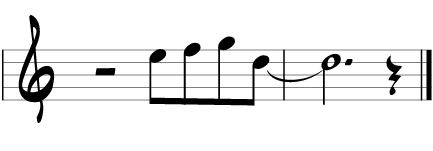

# Scribe

Scribe makes it easy to write music on the web.

Scribe turns an array of notes and chords into music notation that is rendered in SVG.
Writing a tune is as simple as 

## Scribe(svg, data, options)

### svg

Either an id (string) of an SVG node, or an SVG node.

### data

An array of notes and chords. For example:

    [
        ['note',  2,   76,  0.5],
        ['note',  2.5, 77,  0.5],
        ['note',  3,   79,  0.5],
        ['note',  3.5, 74,  3.5]
    ]

Renders as:

That's right. You only need to give it the notes.
Scribe interprets the notes and writes out the notation.

A note array contains four values:
the type string <code>'note'</code>,
the beat, note number and duration.
The beat is the time the note starts expressed in quarter notes.
The note number is an integer 0-127 that corresponds to MIDI note number.
The duration is time the note is held expressed in quarter notes.

Note that it's early days, and the required format of this note data may change.

### options

Scribe's rendered output can be modified with these optionally optional options:

    {
        clef: 'treble',
        clefOnEveryStave: false,
        barsPerStave: 4,
        
        paddingTop: 12,
        paddingLeft: 3,
        paddingRight: 3,
        paddingBottom: 6,
        staveSpacing: 24,
        
        start: 0,
        end: undefined,
        
        key: 'C',
        transpose: 0,

        beamBreaksAtRest: true,
        beamGradientMax: 0.25,
        beamGradientFactor: 0.25
    }

The units for padding and spacing are kind of arbitrary.
1 unit is the distance from a stave line to the center of a stave space.
In other words, a stave is 8 units high.

## Features

Scribe is new.
Some features I intend to implement:

* Key centre analysis, for identifying the key centre of individual phrases (very difficult).
* Multi-stave rendering, for piano or multi-part scores (moderately challenging).
* Live data binding, so that Scribe will automatically show changes in data (piece of piss).

If you like scribe and are interested in helping, please fork and let me know what you might work on.

## Contributions

Rich Sigler of Sigler Music Fonts (http://www.jazzfont.com/).

Very kindly granted permission to use JazzFont shapes as SVG paths.
If you use Scribe a lot, please consider buying a JazzFont license (http://www.jazzfont.com/order.html).
